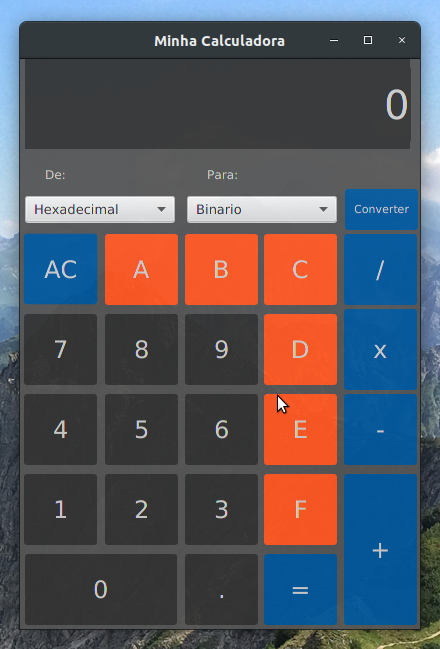

# This repository groups some of my college activities.
- My university education: Analysis and Systems Development
    - Started: Feb/2020
    - Conclude: Jun/2022
    - Institution: FMU - Centro Universitário das Faculdades Metropolitanas Unidas

## Calculator with converter
- [More Details](https://github.com/eltonjtoledo/Calculator-with-converter)

- ### Technologies
    - Java version : openjdk 11.0.8
    - Java FX version: 11.0.2
    - Envivoment linux ubuntu 20.04
- ### Main Screenshot
    - 

___
## WhatTodo
- [More Details](https://github.com/eltonjtoledo/whatTodo)

- ### Technologies
    - AndroidSdk 
    - java JRE
- ### Main ScreenShot
    - 