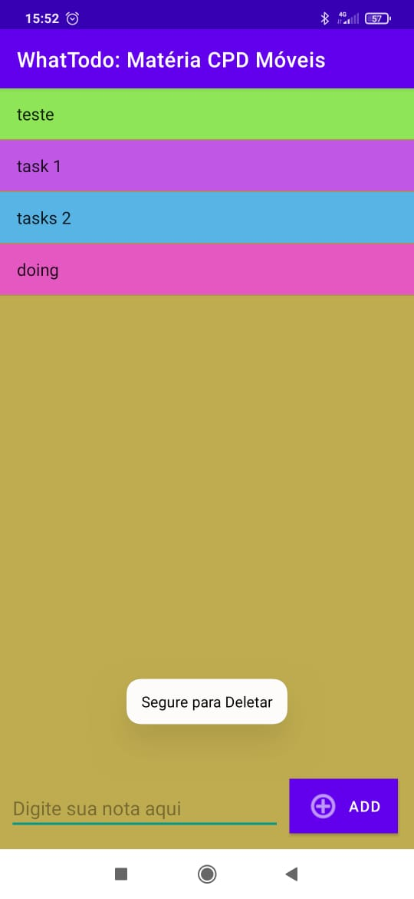
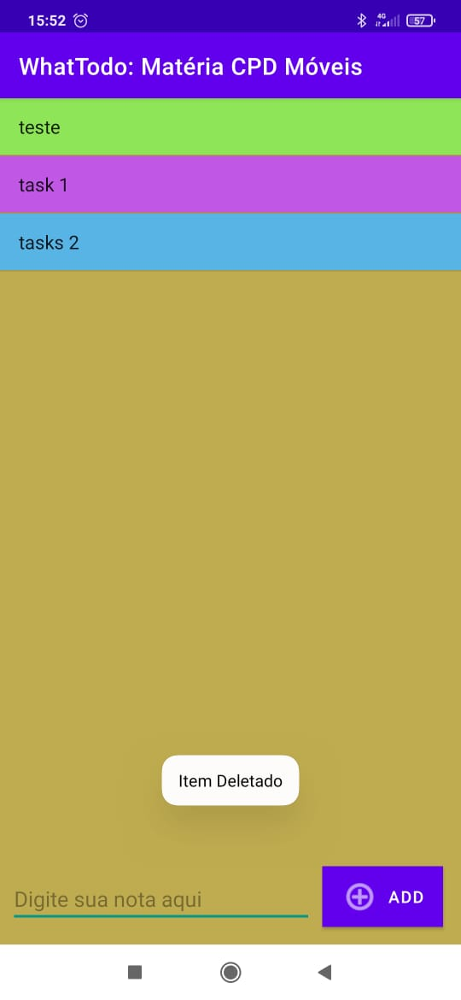
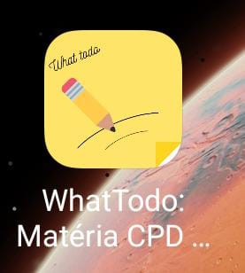

# whatTodo
Project created at the conclusion of the course "COMPUTAÇÃO PARA DISPOSITIVOS MÓVEIS" (Computing for mobile devices) 

Android application, with technological features that can help you in your daily tasks, where you can create notes with different colors and functions for each task.

When entering the "What ToDo" application, you will find an "Add" block to create a new note or task, as soon as the button is pressed, you can write your note or task, and later save the note in the application.

When creating the note, you will have the option to select the color you prefer to differentiate the note according to your preference.
The application is very intuitive and easy to handle, making usability fluid and effective.

- ### Technologies
    - AndroidSdk 
    - java JRE
- ### ScreenShots

    - 
    - 
    - 

___
### Created by:
Elton J. Toledo, Gustavo Franciscon and Angel Diniz

[Elton J. Toledo Linkedin](HTTPS://www.linkedin.com/in/eltonjtoledo) | [Elton J. Toledo Github](https://github.com/eltonjtoledo)
___
[Gustavo Franciscon Linkedin](https://www.linkedin.com/in/gustavofranciscon-7b99121bb) | [Gustavo Franciscon Github](https://github.com/GustavoFranciscon)
___
[Angel Diniz Linkedin](https://www.linkedin.com/in/angel-d-9764a1127)
